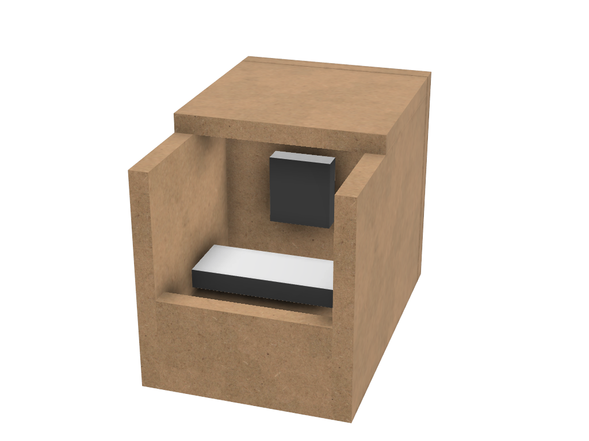

= The ERK-1 CNC
:toc:

Designing, building & blogging a small desktop CNC.

image::images/status.png[]

== What's going on here then?
I'm designing a tiny desktop-friendly CNC. This repository will contain the design files, and I'm also blogging about the project in this readme file.

== Why yet another CNC design?
There are lots of great, free-to-build CNC designs already in existence on the internet. But, there is one particular type of CNC machine that I simply have not found any DIY designs for: The desktop micro mill. Think of those machines dentists use to create dental prostheses. Fully enclosed, tiny CNC machines you can use in an office: not too noisy, and not spewing dust everywhere. Something you could use while living in an apartment for experimenting and learning about CNC, and then being able to stow it away under the desk when not in use.

== Goals
* Apartment friendly
  - Quiet _enough_. CNC cutting will never be silent, but I'm trying to keep it quiet enough that the neighbors don't call the cops.
  - Dust control. CNCs can spew out lots of fine wood dust, and this would be terrible in an apartment. The machine must be fully enclosed, have controlled negative air pressure and a filter for catching all the dust. It needs something like a built-in vaccum cleaner.
  - Stowable. It should all be contained in a single unit, that you can pick up off the desk and stow in a closet. This also means it must be light enough that one person can feasibly carry it.
* Inexpensive
  - I'm going for a price of around 300-400$
* Possible to build without another CNC / Laser cutter. Some parts will unfortunately require a 3D printer. The machine frame will be mostly made out of wood.
* Smallest possible footprint. I'm inspired by the amazingly small Voron 0 3D printer, but will have to scale up a bit from that ideal.

== Non-goals
* Metal milling
  - Out of the question. Nope. Not doing it. This will be a machine that can cut wood, plastics and modeling foam.
* Big working area
  - Not a goal at all. The machine footprint will be tiny in DIY CNC terms, and the cutting area will be even smaller. I'm totally fine with a toy-like working area of 10cm x 13cm x 2cm.
* Precision
  - It would be nice if a tiny mill could mill tiny parts accurately. But this one won't. I'll be using cheap parts. Hopefully some of the parts can be "upgraded" for those with a larger bugdet, without requiring a redesign of the machine. Like using proper brand name linear bearings instead of the bottom dollar stuff I will be using. The bearing form factor will still be the same.

== Bill Of Materials
I haven't designed the whole machine yet, so lots of things are missing in this section.

=== (Motion) electronics
- Controller board: `MKS GEN_L V2.1`
- Stepper motor drivers: 3x `TMC2209 V1.2`. These are silent, have software controlled current settings and support sensorless homing. With these, the machine won't need limit switches.
- Steppers:
  * 2x large `NEMA 17` stepper motors. The X and Y axis motors will be stationary, and they can be larger (longer) than the Z motor.
  * 1x normal-sized `NEMA 17` stepper motor. This will be moving as part of the X-carriage, so it shouldn't be too heavy.
- LCD screen: `RepRapDiscount Full Graphic Smart LCD Controller`
- Wifi controller and web UI: A `Raspberry Pi` running chilipeppr or similar program.

== Update 1 - 2021-03-18

I've started sketching up the frame in Fusion 360. The rough design plan is:

- A cutting area in the upper front part of the machine.
  * Y-carriage moving from front to rear.
  * X carriage moving from side to side
  * Z carriage mounted on the X axis, moving up and down.
- A space under the machine for power-supplies etc.
- A space in the upper rear part of the machine for the motion controller and Raspberry Pi.
- A space in the lower rear part the machine for a powerful exhaust fan and some kind of dust filter. Perhaps this will contain a vaccum bag, and literally work as a built-in vacuum cleaner.

image::images/updates/01/section.png[500,500]

Eventually I realized that the shape and size of the frame is very dependent on the size and position of the spindle. I've made it my first goal to design the Z axis, and to make it as compact as possible. This will determine how small I can make the overall machine. As for the spindle, I'm currently designing for a 200W cheap chinese spindle motor. It seems small enough, yet should be able to cut small pieces of wood nicely.

image::images/updates/01/spindle.png[]

As part of the Z axis design, I'm making CAD models of some of the "standard" linear motion parts I expect to be using. I might even 3D print these models and use them as "mock" parts when prototyping the machine. I still haven't decided on the bearing form factors I will be using, and when I order them it will easily take one or two months before they arrive. Being able to assemble a "fake" version of the Z axis using plastic parts will probably be useful!

image:images/updates/01/LMK8UU v4.png[200,200]
image:images/updates/01/T8 Brass Nut v2.png[200,200]
image:images/updates/01/Spindle Clamp 52mm v2.png[200,200]
image:images/updates/01/Spindle 200W v2.png[200,300]
