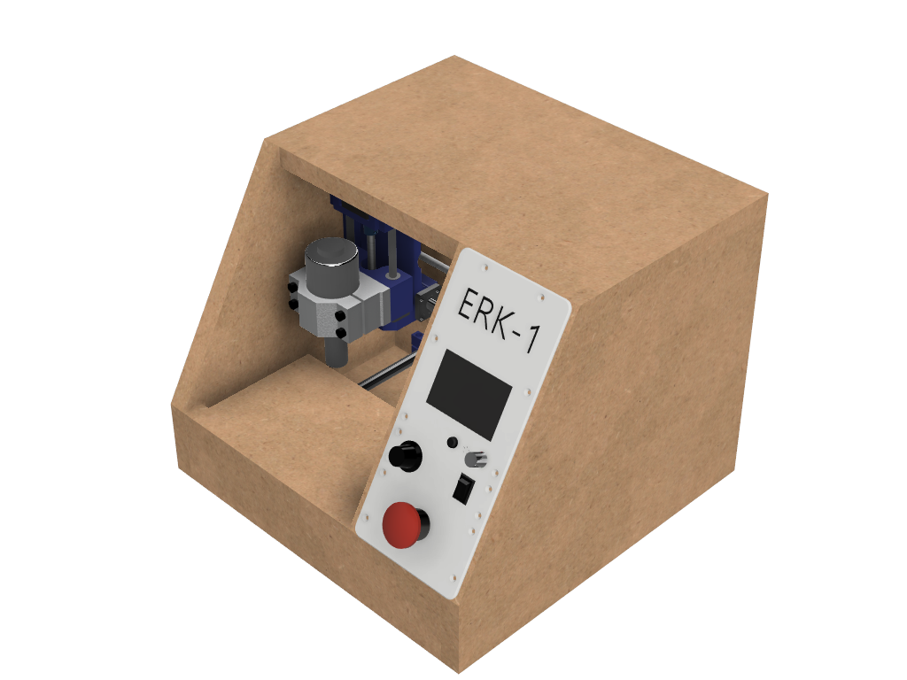
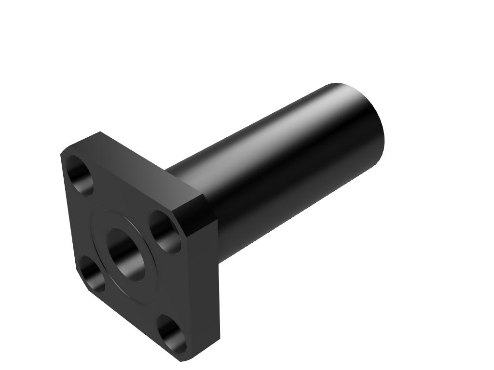

= The ERK-1 CNC
:toc: preamble

Designing, building & blogging a small desktop CNC.

.Current machine status

== What's going on here then?
I'm designing a tiny desktop-friendly CNC. This repository will contain the design files, and I'm also blogging about the project in this readme file.

== Why yet another CNC design?
There are lots of great, free-to-build CNC designs already in existence on the internet. But, there is one particular type of CNC machine that I simply have not found any DIY designs for: The desktop micro mill. Think of those machines dentists use to create dental prostheses. Fully enclosed, tiny CNC machines you can use in an office: not too noisy, and not spewing dust everywhere. Something you could use while living in an apartment for experimenting and learning about CNC, and then being able to stow it away under the desk when not in use.

== Goals
* Apartment friendly
  - Quiet _enough_. CNC cutting will never be silent, but I'm trying to keep it quiet enough that the neighbors don't call the cops.
  - Dust control. CNCs can spew out lots of fine wood dust, and this would be terrible in an apartment. The machine must be fully enclosed, have controlled negative air pressure and a filter for catching all the dust. It needs something like a built-in vacuum cleaner.
  - "Stow-able". It should all be contained in a single unit, that you can pick up off the desk and stow in a closet. This also means it must be light enough that one person can feasibly carry it.
* Inexpensive
  - I'm going for a price of around 300-400$
* Possible to build without another CNC / Laser cutter. Some parts will unfortunately require a 3D printer. The machine frame will be mostly made out of wood.
* As small a footprint as possible. I'm inspired by the amazingly small https://vorondesign.com/voron0[Voron 0] 3D printer, but will have to scale up a bit from that ideal.

== Non-goals
* Metal milling
  - Out of the question. Nope. Not doing it. This will be a machine that can cut wood, plastics and modeling foam.
* Big working area
  - Not a goal at all. The machine footprint will be tiny in DIY CNC terms, and the cutting area will be even smaller. I'm totally fine with a toy-like working area of 13 cm x 10 cm x 2 cm.
* Precision
  - It would be nice if a tiny mill could mill tiny parts accurately. But this one won't. I'll be using cheap parts. Hopefully some of the parts can be "upgraded" for those with a larger budget, without requiring a redesign of the machine. Like using proper brand name linear bearings instead of the bottom dollar stuff I will be using. The bearing form factor will still be the same.

== (Planned) Machine specs

- Fixed-gantry CNC machine
- 200W spindle
- 8 mm linear rods for the Z-axis
- 12 mm linear rods for the X- and Y-axes
- T8 Leadscrew and brass nuts for all axes
- NEMA 17 Stepper motors
- Auto homing - Sensorless, so it can be homed in all directions (X-,X+,Y-,Y+,Z-,Z+)
- Fully enclosed
- Integrated dust filter
- Small desktop footprint (let's say less than 40 cm cubed)
- Working area of around 130 x 130 x 30 mm (X, Y, Z)

== Bill Of Materials
I haven't designed the whole machine yet, so lots of things are missing in this section.

=== Electronics
- Controller board: `MKS GEN_L V2.1`
- Stepper motor drivers: 3x `TMC2209 V1.2`. These are silent, have software controlled current settings and support sensorless homing. With these, the machine won't need limit switches.
- Steppers:
  * 2x large `NEMA 17` stepper motors. The X- and Y-axis motors will be stationary, and they can be larger (longer) than the Z motor.
  * 1x normal-sized `NEMA 17` stepper motor for the Z-axis. This will be moving as part of the X-carriage, so it shouldn't be too heavy.
- LCD screen: `RepRapDiscount Full Graphic Smart LCD Controller`
- Wi-Fi controller and web UI: A `Raspberry Pi` running chilipeppr, cncjs, or similar program.
- Spindle Motor: https://www.aliexpress.com/item/32908212687.html[Chinese 200W ER11 spindle with bracket]

=== Linear Motion
* Z-axis
  - 2x LMK8LUU linear bearings
  - 1x T8 flanged brass nut  (2 Leads, Pitch 2mm)
  - 2x 8x100 mm linear rods
  - 1x T8x90 mm trapezoidal leadscrew (2 Leads, Pitch 2mm)
  - 1x 608ZZ ball bearing ("skate-bearing")
  - 1x Rigid shaft coupling, 5 mm to 8 mm
* X-axis
  - 4x LMK12UU linear bearings
  - 1x T8 flanged brass nut (2 Leads, Pitch 2mm)
  - 2x 12x???mm linear rods (Axis length undecided)
  - 1x T8x???mm trapezoidal leadscrew (2 Leads, Pitch 2mm)
* Y-axis
  - 4x LMK12UU linear bearings
  - 1x T8 flanged brass nut (2 Leads, Pitch 2mm)
  - 2x 12x???mm linear rods (Axis length undecided)
  - 1x T8x???mm trapezoidal leadscrew (2 Leads, Pitch 2mm)

== Update 1 - 2021-03-18

.Humble beginnings
image::images/updates/01/status.png[]

I've started sketching up the frame in Fusion 360. The rough design plan is:

- A cutting area in the upper front part of the machine.
  * Y-carriage moving from front to rear.
  * X-carriage moving from side to side
  * Z-carriage mounted on the X axis, moving up and down.
- A space under the machine for power-supplies etc.
- A space in the upper rear part of the machine for the motion controller and Raspberry Pi.
- A space in the lower rear part the machine for a powerful exhaust fan, and some kind of dust filter. Perhaps this will contain a vacuum cleaner bag, and literally work as a built-in vacuum cleaner.

image::images/updates/01/section.png[500,500]

Eventually I realized that the shape and size of the frame is very dependent on the size and position of the spindle. I've made it my first goal to design the Z axis, and to make it as compact as possible. This will determine how small I can make the overall machine. As for the spindle, I'm currently designing for a 200W cheap chinese spindle motor. It seems small enough, yet should be able to cut small pieces of wood nicely.

image::images/updates/01/spindle.png[]

As part of the Z axis design, I'm making CAD models of some "standard" linear motion parts I expect to be using. I might even 3D print these models and use them as "mock" parts when prototyping the machine. I still haven't decided on the bearing form factors I will be using, and when I order them it will easily take one or two months before they arrive. Being able to assemble a "fake" version of the Z axis using plastic parts will probably be useful!

image:images/updates/01/Spindle Clamp 52mm v2.png[200,200]
image:images/updates/01/Spindle 200W v2.png[200,300]

== Update 2 - 2021-03-19

.It's not easy being small

I've designed a first version of the Z-carriage and started on the X-carriage it rides on.
This machine is inspired by the tiny Voron 0 3D printer, which has _outside_ dimensions of 24 cm cubed. Right now my frame sketch has those _inside_ dimensions in the cutting chamber, so it's already larger than the Voron. And I've designed a Z-axis as small as I could without getting into weird tricks.

And yeah, that's the Z axis stepper motor poking through the top. _Oops._ I can expand the machine dimensions a bit more, but I don't want to go *that* big. I'll have to redesign these parts and save space wherever I can.

[discrete]
=== Z-carriage
The Z-carriage itself is pretty small. Most of it consists of the spindle mount bracket, and a small 3D-printed block to hold 4 bearings and a nut. If I'm sticking with a 52 mm diameter spindle, and the metal bracket, there's not much space that can be saved here.

image:images/updates/02/z-carriage_rear.png[,400]

I actually don't want to use 3D-printed parts in this particular part of the machine. Anywhere but here. The spindle can get pretty hot, and that heat will creep into the 3D-printed block. I don't want to worry about my machine parts melting when I use the machine, so I'll have to pull some tricks here. Perhaps I can design in a sheet of plywood between the aluminium bracket and the 3D-printed block, as thermal insulation. We'll see.

[discrete]
=== X-carriage / Z-axis
The first X-carriage design is a simple box made from 3D-printed parts.
(The stepper motor and coupling don't quite line up with the brass nut in the z-carriage. I'll rework it later.)

There's probably a bit of space to save here.

- The box sides aren't _necessary_. They do help with rigidity though.
- Perhaps the axis could be folded, using a belt drive, so that the stepper motor isn't on top. I don't know where else I want to put it though.
- The whole axis could be made shorter.

In this image, the axis is all the way up, at the end of it's 40 mm travel. The stepper motor shaft and coupling make me waste quite a lot of space. Without those, the box could be shortened, so the Z-axis bearings touch the top of the box in this position. If I choose a stepper motor with an integrated 100 mm leadscrew, instead of a regular shaft, I can save 30 mm of height here. That's probably too good to pass up.

== Update 3 - 2021-03-22

.Redesigned Z-axis

I managed to improve the Z-axis and shrink it down to something usable. I still had to increase the height of the machine a bit, but not that much.
Before and after shots of the Z-axis:

The images are not to scale, so it's not a perfect comparison. The box has been shortened a lot, and the plastic sides are gone. I added clearance for the stepper motor coupler to the Z-carriage part, so I don't have to use a special stepper motor with an integrated leadscrew after all. The Z-carriage now moves all the way up, so it touches the plate holding the stepper motor, and axis travel is still 40 mm.

The Z-axis and X-carriage is now complete, so I will print this version and see if things fit together as planned.

I will also be liberally using "mock" parts for this test assembly, since no linear motion parts have been ordered from ebay yet. A bunch of more standard parts were modeled:

The next step of the design is to revisit the machine frame. I want to make some layout changes before properly designing in the X-axis.

== Update 4 - 2021-03-25

.Redesigned frame

The frame has been redesigned, now it looks more like a usable machine. I plan to have a hinged plexiglas cover in front of the cutting area, and a 3D-printed panel on the right side. The right side panel will hold the LCD-display, emergency stop button, and probably a spindle speed control knob.

image::images/updates/04/frame_top.png[]

The frame plan changed a bit:

- The cutting chamber is still on the front left side.
- There's no longer a power-supply chamber under the machine.
- The whole right side of the machine is now the electronics compartment.
 * (Hopefully I can fit all the controllers and power supplies here.)
- There is another chamber behind the cutting area, that I plan to use for dust management (an integrated vacuum cleaner).

Outside dimensions at this point are:  +
40 cm x 44 cm x 34 cm (width x length x height)

There is also now a complete X-Axis. The rods are held in halfway-trough drilled holes in the wooden side panels. I am unsure if this is a good idea, or if I should design some actual holders for the rods, that then bolt onto the side panels. On the other hand, that would eat up a couple centimetres of X-axis travel.

Next step: The Y-carriage

== Update 5 - 2021-03-29

No real design update today. The Y-axis is in progress. I'll just be writing about electronics and 3D printed prototyping since I think it's neat.

[discrete]
=== Electronics
These are the motion electronics I plan to use (disregard the blue lab power supply at the top):

The controller board is the `MKS GEN_L V2.1`. It's based on the 8-bit ATMEGA2560 CPU, quite common among 3D printer controller boards, and has nice inputs and outputs for the common things a 3D-printer needs. It's also quite easy to repurpose for driving a CNC.

The stepper drivers I am using are the `TMC2209`, and they should be very good in combination with this board. For one thing, the drivers make the steppers move very quietly. The stepper motor noise is not much compared to a cutting tool driving through wood, but every little bit helps. The board supports communicating with these drivers over UART, so the board can send configuration commands to the drivers, and get status updates in return. This lets us configure the stepper motor current in the firmware. For example, we can set the current of each driver to exactly 1400mA, instead of fiddling with a tiny potentiometer to try to achieve a similar result.

The stepper drivers can also tell the firmware when motors are unable to move as commanded; when they lose steps. This means we can let the machine home itself without using any limit switches. We just tell the machine to move as far as possible along, say, the negative X-axis. When the machine hits the end of its travel, the motors will stall, and the stepper drivers will let the controller board know. We can then mark the current X position as X=0. This also lets us do the same thing for the positive X direction, and the same for the Y-axis and Z-axis. This is normally not supported on such machines, as positive homing would require 3 extra limit switches, in addition to the regular 3 switches used for homing each axis to zero.

The plan is to use this for usability improvements in the machine. Like automatically homing each axis to the positive direction after a cutting job. This would move the spindle up and to the right (out of the way), while pushing the Y-carriage towards the user. Which is nice.

[discrete]
=== Prototyping
I have printed a prototype of the Z-carriage and X-carriage. The parts printed in white are "real" machine parts; I intend for these to be 3D-printed in the final machine. The blue parts are just stand-ins; these are supposed to be standard linear motion parts that will be ordered when the machine design is complete. I already had these modeled to help with the CAD design of the machine, so it didn't take much extra work to get them 3D-printed.

.Z-axis all the way down

.Z-axis all the way up

.Z-carriage with mock spindle and motor mount

.Z-carriage with mock spindle and motor mount, disassembled

Prototyping like this is not only *fun*, but also lets me get a feel for the assembly of these parts, and catch problems early. Assembly went ok this time, there were no inaccessible screw-holes or such things. I found a few things I want to change though.

The current X-carriage consists of two parts: A large base part, and a top plate (holding the stepper motor) that screws into it from the top.

.Full Z-axis (Z-carriage and X-carriage)

I was hoping the screws would hold these two pieces tightly together and in alignment. After seeing it in real life, I don't think the screw connection is strong enough. I will probably redesign the X-carriage to be a single part. This also lets me push the top X-rail higher up on the X-carriage, giving a longer distance between the X-axis rails. This is generally a good idea, mechanically.

I also think I can save a centimeter or two in the width of the X-carriage. The width of the Z-carriage is more or less defined by the width of the motor mount; this doesn't need to carry over to the X-carriage. At the very least the linear bearing flanges don't need to stick out of the sides of the X-carriage. This gives less distance (left to right) between the X-rail bearings, which is not a good idea mechanically. The upside is that it would give me more X-axis travel without increasing the width of the machine.

== Update 6 - 2021-03-31

.All 3 axes designed

The machine now has a Y-carriage and Y-axis! Once all the three axes were in place, lots of small adjustments happened.

- The X-axis was aligned, so the cutting tool is in the middle of the Y-axis.
- The angle on the front of the frame was changed from 45 deg to 30 deg. The top of the spindle motor could collide with the front plexiglas without this change.
- I also increased the Z-axis travel from 40 mm to 60 mm. This is just to ensure the Z-axis has enough clearance, even when using long or short cutting tools. In practice the thickest material you will be able to work with is still only 20-30 mm.

So far I've been designing the frame with a 28 mm material thickness. The MDF wood sheets I will be using are actually 22 mm thick, so I updated the model to match this. The machine outer dimensions became slightly smaller as a result. Right now the machine dimensions are 396 x 396 x 324 mm (width, length, height). The machine travel is 138 x 130 x 60 mm (X, Y, Z). The model is parametric, so I can change this at will, but I'm currently trying to make the machine fit inside a 40 cm cube.

Axis travel *will* decrease in the future, since I've decided to change how the linear rails and screws mount to the frame. They are currently designed to fit inside halfway-through drilled holes in the frame sides. The positions of these drilled holes are absolutely critical, and if a hole is off by a fraction of a millimeter the axis will bind up instead of moving smoothly. I want the machine to be easy (and not require a CNC) to make, so this will not work.

I will be designing some 3D-printed "cassettes" to hold the rails and leadscrews, and these can be screwed (as a unit) inside each side of the frame. This will eat up maybe 2 cm of travel on the X and Y axes, but I think it is a necessary change.

At this point I could go on to modeling the electronics and filling out the electronics compartment, but I have quite a few things I want to refine and adjust in the cutting part of the machine first.

== Update 7 - 2021-04-04

image::images/updates/07/status.png[]

The changes are hardly visible in the machine frame image, but I have been reworking some details in the Z- and X-axes.

The X-carriage is now a single 3D-printed part. It also has some large cutouts at the back to reduce plastic usage and printing time. Hopefully it will still be strong enough for the machine. The Z-axis linear rails now insert from the top, and get clamped in place with a bolt and nut. The X-carriage has also been slimmed down a bit, gaining 12 mm of X-axis travel.

The X-axis also has some changes: The "cassettes" or mounting blocks have been designed. These ensure that the X-axis linear rails and leadscrew are parallel to each other. These blocks still have to be bolted to the frame sides with some precision, so the linear rails are perpendicular to the frame, but hopefully this is doable by hand.

image::images/updates/07/x-axis.png[]

Each of the mounting blocks are 10 mm thick, so in the worst case they eat up 20 mm of axis travel. In combination with the slimmer X-carriage, X-axis travel was only reduced by 8 mm. Not too bad!

With some luck, I will be able to add these mounting blocks to the Y-axis without affecting travel at all. I can just make the Y-carriage 20mm shorter, underneath the spoilboard, to compensate.

Next up: The Y-axis also needs a pair of these mounting blocks.

== Update 8 - 2021-05-02

I have taken about a month of hiatus from the project. Linear motion parts were all ordered in the meantime, and I expect the last packages to arrive next week. Soon I can do test fitting with real parts. This time I finished up the "casette" design, so the Y-axis now has a pair of mounting blocks for holding the linear rails and leadscrew. This means the cutting chamber of the machine is fully designed (or, at least the first version of it). Things will probably still change as I start building the machine and find out where the snags are.

.Y-axis with mounting blocks

Other minor adjustments:

- Switched over to using rigid couplings between stepper motors and leadscrews, on all axes. The design still has clearance for the larger flexible type couplings, for those who want to use that.
- Improvement to ease assembly: the Z-axis leadscrew can now be inserted/removed through a hole in the bottom of the X-carriage. You no longer need to remove the Z-axis stepper motor to get at it.

